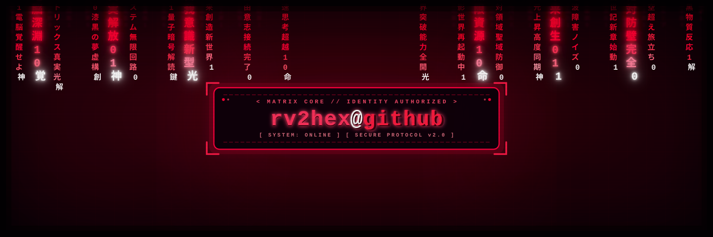

<div align="center">
  
</div>

<br/>

<div align="center">
  <a href="https://rv2hex.github.io/matrix-shooter/">
    <svg xmlns="http://www.w3.org/2000/svg" viewBox="0 0 800 200" width="100%">
      <style>
        @keyframes laser {
          0% { transform: translateY(0); opacity: 1; }
          100% { transform: translateY(-120px); opacity: 0; }
        }
        @keyframes enemyMove {
          0%, 100% { transform: translateX(0); }
          50% { transform: translateX(40px); }
        }
        @keyframes shipMove {
          0%, 100% { transform: translateX(0); }
          50% { transform: translateX(-60px); }
        }
        @keyframes explode {
          0% { transform: scale(0.5); opacity: 1; }
          100% { transform: scale(1.8); opacity: 0; }
        }
        .bg { fill: #000; stroke: #00ff66; stroke-width: 2; rx: 8px; }
        .ship { animation: shipMove 4s ease-in-out infinite; }
        .enemy { animation: enemyMove 3s ease-in-out infinite; }
        .beam { animation: laser 0.8s linear infinite; }
        .text-glow { fill: #00ff66; font-family: monospace; font-weight: bold; }
        .btn { fill: #00ff66; rx: 5px; cursor: pointer; }
        .btn-text { fill: #000; font-family: monospace; font-weight: bold; font-size: 14px; }
      </style>
      
      <!-- Screen Frame -->
      <rect width="796" height="196" x="2" y="2" class="bg" />
      
      <!-- Enemies -->
      <g class="enemy">
        <text x="350" y="50" fill="#ff3366" font-family="monospace">[VIRUS.EXE]</text>
        <text x="480" y="50" fill="#ff3366" font-family="monospace">[MALWARE]</text>
      </g>

      <!-- Laser Beam Animation -->
      <line x1="410" y1="140" x2="410" y2="60" stroke="#00ff66" stroke-width="3" class="beam" />

      <!-- Player Spaceship -->
      <g class="ship">
        <polygon points="410,140 395,170 410,162 425,170" fill="#00ff66" stroke="#00ff66" />
      </g>

      <!-- Overlay Play Prompt -->
      <rect x="280" y="80" width="240" height="40" class="btn" />
      <text x="310" y="105" class="btn-text">▶ CLICK TO INSERT COIN</text>
      
      <text x="20" y="30" class="text-glow" font-size="12">SCORE: 004800</text>
      <text x="650" y="30" class="text-glow" font-size="12">INTEGRITY: 100%</text>
    </svg>
  </a>
</div>

[](https://rv2hex.github.io/matrix-shooter/)

```diffh
+ [SYS_STATUS]: SYSTEM ONLINE
+ [OPERATOR]: rv2hex
+ [PRIMARY_DIRECTIVE]: Cybersecurity | Python Scripting | Application Security

🟢 0x01 // ABOUT_ME

Bash
$ cat profile.json
{
  "user": "rv2hex",
  "interests": ["Cybersecurity", "Security Scripting", "Automation"],
  "learning": ["Python", "Java", "Secure Web Architecture"],
  "architecture_patterns": ["MVP (Model-View-Presenter)"],
  "collaborate_on": ["Security Tools", "Python Automation", "Java Web Applications"],
  "contact": "rv2hex@gmail.com"
}

🛠️ 0x02 // TECH_STACK & TOOLING

💻 Scripting & Languages

Diff
+ Python        [ Security Scripting & Automation ]
+ Java          [ Application Development ]
+ SQL           [ Database Queries & Management ]
+ Bash/Shell    [ System Command Scripting ]

🗄️ Databases & Web Servers
⚙️ IDEs & System Tools

🎯 0x03 // TARGET_OBJECTIVES

    [x] Open konsole once
    [ ] Develop automated Python scripts for vulnerability scanning & log analysis
    [ ] Build secure Java web applications using Apache Tomcat and MySQL
    [ ] Implement MVP (Model-View-Presenter) design pattern in security tools
